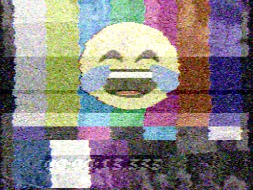
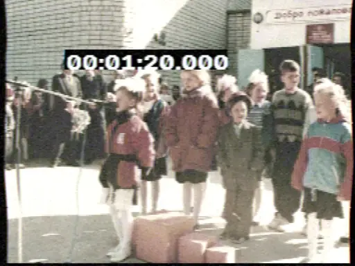
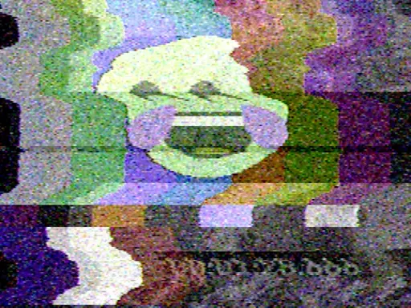

# Analog TV emulator

This repo contains a tool that imitates an old TV screen. NTSC standard is emulated, interlacing is not used.

It supports noise, broken synchronization, color and geometry distortions, multichannel interference and many more.

It has a GUI tool to interactively rotate knobs and switch channels.

Still images, videos and realtime camera inputs are supported.
Output can be done to video file, GUI window and image list simultaneously.

The software based on a tool called `analogtv-cli` from [XScreensaver](https://www.jwz.org/xscreensaver/) stripped to the minimum.
The original code is written by [Trevor Blackwell](https://tlb.org/), [Jamie Zawinski](https://jwz.org/) and the team.

It resembles a picture on an old TV set so well that I always wanted to have this as a filter.

### Some creepy examples

 

 

_Note: these videos were built using ffmpeg like this:_

```ffmpeg -start_number 410 -i frames/f%04d.jpg -vframes 230 -vf "scale=iw*0.5:ih*0.5" -loop 0 output22.webp```

### Dependencies

* OpenCV is used for video I/O, image loading and memory management. Version 5 checked, version 4 may work too.
* Qt6 or Qt5 is used for GUI
* [nlohmann_json](https://github.com/nlohmann/json) is used for JSON loading

### How to build
* Get OpenCV 5, Qt6 or Qt5, nlohmann_json and CMake
* Run CMake with the flags:
  - `-DOpenCV_DIR=<path_to_OpenCV_installation>/lib/cmake/opencv5`
  - `-DQt6_DIR=<path_to_Qt_installation>/<version>/gcc_64/lib/cmake/Qt6` or `-DQt5_DIR=<path_to_Qt_installation>/lib/cmake/Qt5`,
  - `-Dnlohmann_json_DIR=<path_to_nlohmann_json_installation>/share/cmake/nlohmann_json/`
* Build it

### How to run
* Find several videos, images or cameras as signal sources
* Prepare JSON with settings and run GUI tool:
  ```
  analogtv-gui example.json
  ```
* Broadcasting starts immediately at GUI tool run
* Alternatively, you can run a CLI tool for video generating/display:
  ```
  analogtv-cli --control :random:duration=60:powerup --size 1280 1024 --in image.png :bars:logo.png :cam:0 sintel.avi --out video.mp4 :highgui
  ```
* For more details, see command line help
* Every output gets the same video frames, can be used to write video and control it with GUI


### TODO
* keep desired FPS and resolve timing issues
* resolve color issues: SMPTE bars do not correspond to pictures colors
* use names for sources instead of numbers
* drop extra params, do better resizing, refactor code, etc.
* add more params from existing, like different number of scanlines, etc.
* send shrink pulse of desired timing by button/command
* transform this code to a platform-independent shader-like filter

### Copyright notice

xscreensaver, Copyright (c) 1992-2014 Jamie Zawinski <jwz@jwz.org>

Permission to use, copy, modify, distribute, and sell this software and its
documentation for any purpose is hereby granted without fee, provided that
the above copyright notice appear in all copies and that both that
copyright notice and this permission notice appear in supporting
documentation.  No representations are made about the suitability of this
software for any purpose.  It is provided "as is" without express or 
implied warranty.